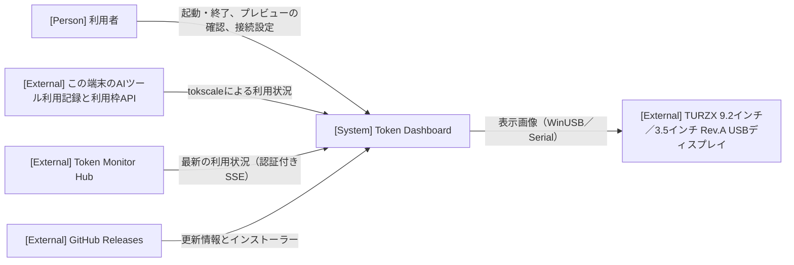

# アーキテクチャ

全体構造、共通方針、設計上の制約の正本です。具体的な処理は実現パターンの設計、保存形式は [データ設計](design/data.md)、仕様は [ユースケース一覧](project.md#usecases) から参照します。

## 1. システムコンテキスト

## 2. コンテナ

| コンテナ | 技術 | 責務 | リポジトリ内パス |
| --- | --- | --- | --- |
| 常駐アプリ本体 | Go・Wails v3、同梱した tokscale | タスクトレイ常駐、選択した取得元からの取得、表示画像の生成、TURZX への送信、設定の保存、新版の確認・取得・検証 | `main.go`、`internal/` |
| ウィンドウ画面 | React・TypeScript（WebView2） | 本体が生成した表示画像のプレビュー、接続設定の入力、更新の適用操作 | `frontend/` |
| 更新インストーラー | NSIS | アプリ本体の終了後にファイルと登録情報（サインイン時の自動起動を含む）を更新し、アプリを再起動する | `build/windows/nsis/` |

状態の所有者は常駐アプリ本体です。取得した最新の利用状況は本体のメモリにだけ持ち、保存しません。永続化するのは取得元・接続設定・表示先で、保存形式は [データ設計](design/data.md) に記します。表示画像は本体が1枚だけ生成し、同じ画像を TURZX とプレビューの両方へ渡します。ウィンドウ画面は画像を描かず、状態も持ちません。ウィンドウを閉じても本体はタスクトレイで動き続けます。

依存方向は、ウィンドウ画面から本体の Wails サービスへの呼び出しと、本体からウィンドウ画面へのイベント通知だけです。関係線ごとのモック切り替え境界は次のとおりです。

- **Hub と本体の間**: モックの合成点は置きません。検証時は、接続設定の URL を制御可能な SSE サーバーへ向けます。
- **本体と TURZX の間**: モックの合成点は置きません。自動検証は機器を接続しない状態で行い、表示内容はプレビューで確認します。TURZX への実表示は実機で確認します。
- **本体と GitHub Releases の間**: 段階2・3のモックに限り、モックでの起動のときだけ、更新元を本体が作る署名付きの固定の新版（ローカルのフォルダー）へ向け、インストーラーの起動を何もしない処理に置き換えます。確認・取得・検証・適用前の再検証と終了は本番の処理を使います。
- **本体の最新状態**: 表示画像は本体が描くため、表示画像を確認する段階2・3のモックに限り、本体が Hub の受信の代わりに、本番の型の固定データを最新状態へ入れます。モックでの起動のときだけ有効にし、描画、TURZX への送信、プレビューへの受け渡しは本番の処理を使います。

## 3. 実現パターン

各パターンの設計は、適用するユースケースに着手したときに `design/UCP-n.md` として作成します。

| 実現パターンの設計 | 適用条件・関与コンテナ |
| --- | --- |
| [UCP-1. 受信した最新状態を表示画像にして出力する](design/UCP-1.md) | 外部から受けた状態をメモリ上の最新状態へ反映し、1枚の表示画像を生成して TURZX とプレビューへ出力する（「利用状況をUSBディスプレイに表示する」）。常駐アプリ本体、ウィンドウ画面、外部の Hub と TURZX |
| [UCP-2. 入力した設定を検証・保存し、実行中の処理へ反映する](design/UCP-2.md) | 画面で入力した設定を本体で検証して保存し、依存する処理を新しい設定でやり直す（「利用状況の取得元と表示先を設定する」）。常駐アプリ本体、ウィンドウ画面 |
| [UCP-3. 検証・引き渡し・外部プロセスによる確定](design/UCP-3.md) | 検証済みの更新を外部プロセスへ引き渡し、アプリの終了後に確定する（「新版を確認してアプリを更新する」）。常駐アプリ本体、ウィンドウ画面、更新インストーラー、外部の GitHub Releases |

## 4. 設計上の制約

- 選択した取得元からの取得、TURZX への送信、新版の確認は、それぞれ独立した goroutine で動かします。どれかの失敗や待機が、他の処理とタスクトレイ・ウィンドウの応答を止めないようにします。取得元を保存したら従前の取得処理を止め、選択した取得元だけを起動します。
- TURZX への送信は1台に限り、逐次で行います。送信中に次の表示画像ができた場合は、最新の1枚だけを残して前の画像を捨てます。送信中に切断された画像は再送せず、再接続後に最新の画像を送ります。
- 表示プロファイルと物理デバイスの種類は別に扱い、機器選択でプロファイルを自動変更しません。画像サイズが機器に合わない場合は送信せず、原因をログに記録します。9.2インチは 1920×462 の表示画像を時計回りに90度回転した Baseline JPEG（品質85）として WinUSB で送り、3.5インチ Rev.A は 480×320 の表示画像を RGB565LE として Serial で送ります。プレビューには機器向けの変換前の画像を渡します。
- 表示画像の描画には、Windows に標準で入っている游ゴシックを使います。フォントはアプリに同梱しません。
- 9.2インチの TURZX は、標準のインターフェース GUID `GUID_DEVINTERFACE_USB_DEVICE` のうち VID/PID が `1CBE:0092` のものとして列挙し、抜き差しを検出します。ドライバーの導入時に決まる GUID には依存しません（[確認した事実](project.md#design)）。
- 3.5インチ Rev.A は VID/PID `1A86:5722` とシリアル番号／PNP Device ID の `USB35INCHIPSV2` で識別します。機器の識別子とCOM番号を分け、抜き差し時は現在のCOMポートを再検出します。判定・送信・終了の条件は [対象系列](usecases/利用状況をUSBディスプレイに表示する/scenarios/3.5インチ%20Rev.A%20に表示する.md) に従います。
- Hub の認証トークンは、本体から画面へ返しません。ログにも出しません。ログに書くのは、接続先を特定しない原因の分類だけです。
- 本体は多重起動を防ぎます。2つ目の起動では、既に動いている本体のウィンドウを表示します。
- 本番の画面は同梱したアセットだけを使います。外部のコンテンツにはアプリの権限を与えません。
