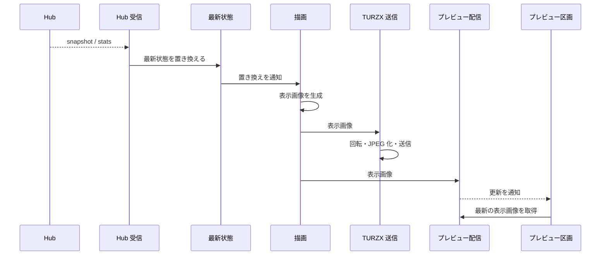

# UCP-1. 受信した最新状態を表示画像にして出力する

適用条件と関与コンテナは [アーキテクチャの一覧](../architecture.md#patterns) を参照します。図は主成功系列を役割名で示し、UC ごとの逸脱は末尾に記録します。

| 役割 | 責務 | 実装パス（段階4完了時に記入） |
| --- | --- | --- |
| Hub 受信 | 保存済みの接続設定で SSE に接続し、snapshot・stats を最新状態へ渡す。止まったら1秒から倍にしながら（上限60秒）再接続する。接続設定の保存時にも接続し直す | `internal/hub/receiver.go` |
| ローカル取得 | 取得元が `Local` のとき、同梱の tokscale を専用の設定ディレクトリで実行する。起動時に探索先ファイルの探索先（なければ `clients --json` の探索先。Cursor を除く）の監視を始め、`cursor sync --json` の後に `graph --no-spinner` で3期間を集計し、並行して `usage --json` で利用枠を取得する。`clients --json` を実行したときは、その後に最初に成功した graph の `summary.clients` と合わせて探索先ファイルに保存し、graph に既知でないツールが現れたときに取り直す。変更は最初の通知から2秒待ってまとめ、graph は開始間隔10秒以上・同時に1つまでとし、Cursor の同期とは同時に実行しない。利用枠は、提供元が取得を制限するため、利用記録の変更や Cursor の同期とは切り離し、前回の取得から2分ごとに取得する（これより頻繁には取得しない）。取得結果から抜けた提供元は、前回の値を保つ。Cursor の同期は起動時の結果に応じて45秒ごと・停止・待ち時間を倍にする再試行（上限10分）とする。日付が変わると集計し直す。集計と利用枠がそろってから最新状態へ渡し、内容が同じなら渡さない。失敗した値は前回のまま保つ。取得元の変更と終了時に監視と子プロセスを止める | `internal/localusage/reader.go`、`internal/localusage/tokscale.go`、`internal/localusage/scan.go`、`internal/localusage/platform_windows.go` |
| 最新状態 | 受信した利用状況をメモリにだけ保持し、置き換えを描画へ通知する | `internal/usage/usage.go` |
| 描画 | 最新状態の置き換え・保存済みの表示スタイルや表示プロファイル、自動ページ送り設定の変更・周期更新で表示画像を描く。9.2インチは通常1分周期、3.5インチは自動ページ送りが有効な間だけ保存済みの5/10/15/30/60秒の間隔を上限に再描画し、無効時は第1ページ固定で通常周期へ戻す。利用枠は表示スタイルが `Gauges`（既定）なら円弧のゲージ、`Bars` なら横棒で描き、色は同じ規則（ペースと残量の悪い方）で決める | `internal/display/render.go`、`internal/display/gauges.go`、`internal/display/compact.go`、`internal/display/profile.go`、`internal/display/service.go` |
| TURZX 送信 | 表示画像を90度回転して JPEG にし、表示先の TURZX へ逐次送る。送信中に届いた画像は最新の1枚だけ残す。再接続時に最新の画像を送る。アプリの終了時に再起動コマンドを送る | `internal/display/output.go`、`internal/turzx/protocol.go`、`internal/turzx/conn_windows.go` |
| 利用枠の選択 | `Display` 画面の `Usage Limits` で、契約と枠の表示・非表示を選ぶ。表示しない枠の識別子を設定ファイルの `hiddenLimits` に保存し、保存のたびに描画へ再生成を求める。描画は、最新状態から表示しない枠を取り除いたものに、契約の選び方・並び順の規則を適用する。保存に失敗したときは、選択も表示画像も変えずにエラーを返す。保存済みの選択を読めないときは、すべての枠を描く | `internal/display/limits.go`、`internal/display/service.go`、`internal/settings/service.go`、`frontend/src/usecases/show-usage/UsageLimitSelect.tsx`、`frontend/src/features/display/queries.ts` |
| プレビュー配信 | 本体の Wails サービス。最新データからプレビュー画像を返し、画像の更新をイベントで通知する。複数ページを持つレイアウトでは全ページを同じ最新状態から生成し、指定されたページ番号を範囲内に補正して返す | `internal/display/service.go`、`internal/display/compact.go` |
| プレビュー区画 | ウィンドウで最新のプレビュー画像を表示する。3.5インチの複数ページ表示では第1ページから開始し、下部のページインジケーターをクリックしたときだけ選択ページを変える。プレビュー右側で実機の自動ページ送りON/OFFと間隔を即時保存し、更新イベントではプレビューの選択ページを維持する | `frontend/src/usecases/show-usage/UsagePreview.tsx`、`frontend/src/features/display/queries.ts`、`frontend/src/usecases/configure-hub/SettingsDraft.tsx`、`internal/settings/service.go` |

- 整合性: 状態更新の主体は最新状態 / 結果確定点はメモリ上の最新状態の置き換え / 障害時は、受信の失敗では最後の最新状態と表示を保ったまま再接続を続け、TURZX の送信失敗では画像を捨てて再接続後に最新の画像を送る。どちらも他方とアプリを止めない / 境界は、描画と送信を最新の1枚だけで追いつくようにすること。
- モックに置き換える境界と合成点: 本番の実行経路は Hub 受信とローカル取得の実処理だけを使い、最新状態へ仕様合意用の固定データを入れる分岐は置かない。Hub 経路の検証時は、接続設定の URL を制御可能な SSE サーバーへ向け、受信・描画・プレビュー配信は本番の処理を使う。起動・終了と検証の手順は [プロジェクト定義](../project.md#execution) を参照する。

UC 固有の逸脱: なし
